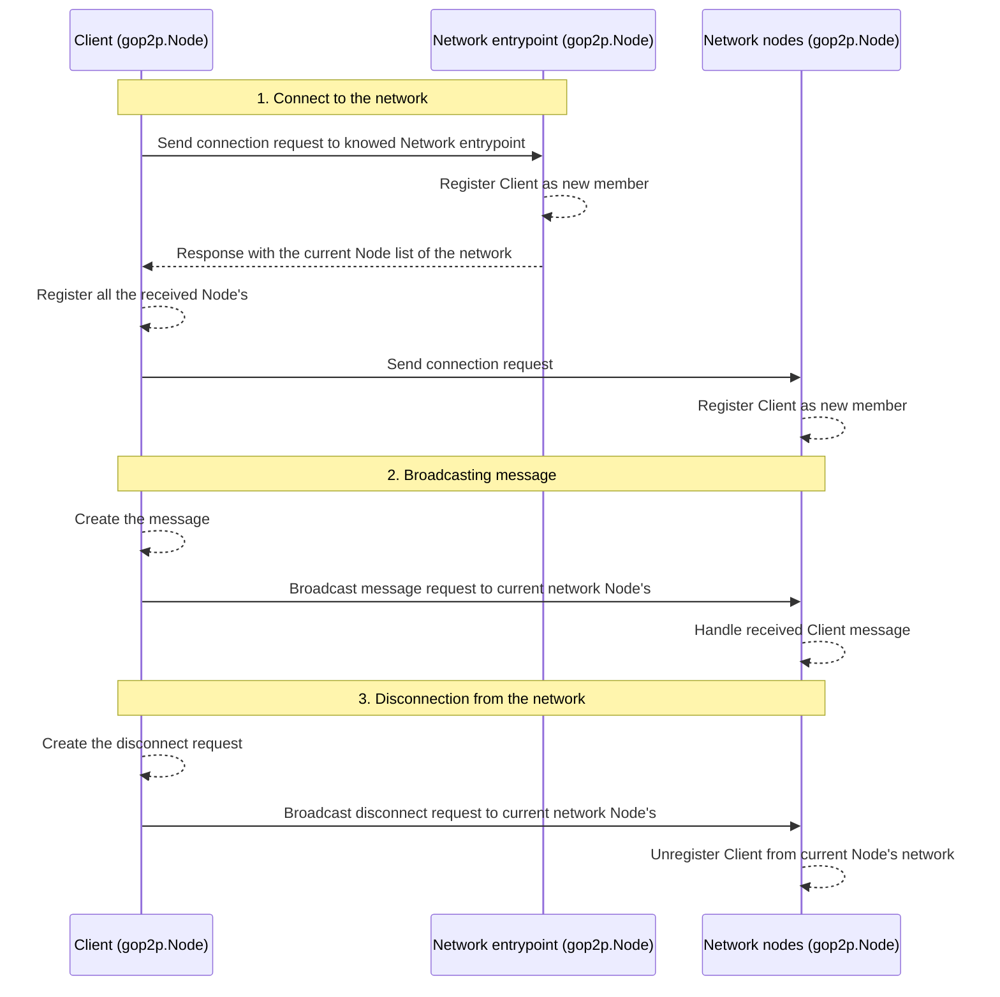

[](https://godoc.org/github.com/lucasmenendez/gop2p) [](https://goreportcard.com/report/github.com/lucasmenendez/gop2p)

# gop2p
Simple *Peer-to-Peer* protocol implementation in pure Go. Uses HTTP client and server to communicate over internet to knowed network members.

## Download
```bash
go get github.com/lucasmenendez/gop2p@latest
```

## Docs & example
- Checkout [GoDoc Documentation](https://godoc.org/github.com/lucasmenendez/gop2p).
- Also, it is available a simple **example** that implments a CLI Chat [here](example/cli-chat/).

### Workflow explained

gop2p implements the following functional workflow:



#### 1. Connect to the network
The client `gop2p.Node` know a entry point of the desired network (other `gop2p.Node` that is already connected). The entry point response with the current network `gop2p.Node`'s and updates its members `gop2p.Node` list. The client `gop2p.Node` broadcast a connection request to every `gop2p.Node` received from entry point.

```go
package main

import (
	"log"

	"github.com/lucasmenendez/gop2p"
	"github.com/lucasmenendez/gop2p/pkg/message"
	"github.com/lucasmenendez/gop2p/pkg/peer"
)

func main() {
    // -> init
    node := gop2p.StartLocalNode(5001) // Local Node
    // node := gop2p.StartNode("0.0.0.0", 5001) // Remote Node
    defer node.Wait()

    // -> connect
    node.Connect <- peer.Me(5000) // Local entry point Node
    // node.Connect <- peer.New("192.68.1.43", 5000) // Remote entry point Node

    // -> print incoming messages and erros
    var logger = log.New(os.Stdout, "", 0)
    go func() {
        for {
            select {
            case msg := <-node.Inbox:
                logger.Printf("[%s] -> %s\n", msg.From.String(), string(msg.Data))
            case err := <-node.Error:
                logger.Fatalln(err)
            }
        }
    }()

    // ...
}
```

#### 2. Broadcasting 
The client `gop2p.Node` prepares and broadcast a `gop2p.Message` to every network `gop2p.Node`.

```go
package main

import (
	"log"

	"github.com/lucasmenendez/gop2p"
	"github.com/lucasmenendez/gop2p/pkg/message"
	"github.com/lucasmenendez/gop2p/pkg/peer"
)

func main() {
    // ...

    var data = []byte("Hello network!")
    var msg = new(message.Message).SetFrom(node.Self).SetData(data)
    node.Outbox <- msg

    // ...
}
```

#### 3. Disconnect 
The client `gop2p.Node` broadcast a disconnection request to every network `gop2p.Node`. This `gop2p.Node`'s updates its current network members list unregistering the client `gop2p.Node`.

```go
package main

import (
	"log"

	"github.com/lucasmenendez/gop2p"
	"github.com/lucasmenendez/gop2p/pkg/message"
	"github.com/lucasmenendez/gop2p/pkg/peer"
)

func main() {
    // ...
    close(node.Leave)
}
```