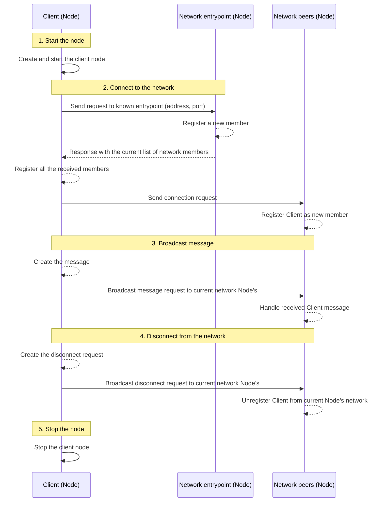

[](https://godoc.org/github.com/lucasmenendez/gop2p) [](https://goreportcard.com/report/github.com/lucasmenendez/gop2p)
[](https://github.com/lucasmenendez/gop2p/actions?query=workflow%3Atest)
[](LICENSE)

# gop2p
Simple *Peer-to-Peer* protocol implementation in pure Go. Uses HTTP client and server to communicate over internet to knowed network members.

## Download
```bash
go get github.com/lucasmenendez/gop2p@latest
```

## Docs & example
- Checkout [GoDoc Documentation](https://godoc.org/github.com/lucasmenendez/gop2p).
- Also, it is available a simple **example** that implments a CLI Chat [here](example/cli-chat/).

### How to use it
The main component to use gop2p is the `node.Node` struct, that contains: 

 * Required _parameters_ to handle **messages/errors**, and **connect/disconnect** a `node.Node`:

```go
    type Node struct {
        Self    *peer.Peer    // information about current node
        Members *peer.Members // thread-safe list of peers on the network

        Inbox chan *message.Message // readable channels to receive messages
        Error chan error            // readable channels to receive errors

        Connection chan *peer.Peer       // writtable channel to connect to a Peer
        Outbox     chan *message.Message // writtable channel to send messages
        // ...
    }
```

 * Required _functions_ to **create**, **start** and **stop** a [`nod.Node`:

```go
    func New(self *peer.Peer) *Node {
        // ...
    }

    func (node *Node) Start() {
        // ...
    }

    func (node *Node) Stop() error {
        // ...
    }
```

#### 1. Start a `node.Node`

To start a new `node.Node` ad be able to send and receive messages (`message.Message`) is required to instance a new `peer.Peer` with the network information (host IP address and port to listen requests).

<details>
<summary style="padding-left: 5vh">Show a code example</summary>

```go
package main

import (
	"log"

	"github.com/lucasmenendez/gop2p/pkg/node"
	"github.com/lucasmenendez/gop2p/pkg/message"
	"github.com/lucasmenendez/gop2p/pkg/peer"
)

func main() {
    // Instance a new peer that identifies the current node
    self, _ := peer.Me(5001, false)
    // [FOR REMOTE CLIENT] self, _ := peer.Me(5001, true)

    // Create a new node with the self peer defined
    client := node.New(self)

    // Start listening to be able to send and receive messages
    client.Start()

    //...
}

```
</details>

#### 2. Connect to a network and listen fo `message.Message` or `error`s
To connect to a network you must know the `peer.Peer` information of an entrypoint. Use `node.Node.Connection` channel to connect to it, the `node.Node.Inbox` channel to listen for messages and the `node.Node.Error` channel to listen for errors.

<details>
<summary style="padding-left: 5vh">Show a code example</summary>

```go
package main

import (
	"log"

	"github.com/lucasmenendez/gop2p/pkg/node"
	"github.com/lucasmenendez/gop2p/pkg/message"
	"github.com/lucasmenendez/gop2p/pkg/peer"
)

func main() {
    // ...

    // Create an entry point peer
    entryPoint, _ := peer.Me(5000, false)
    // [REMOTE ENTRYPOINT] entryPoint, _ := peer.New("192.68.1.43", 5000)

    // Connection to the defined entry point peer usign the Connect channel
    client.Connection <- entryPoint

    // Print incoming messages and errors. Every incoming message is populated
    // through Node.Inbox, and every error channel that occurs trough Node.Error
    // channel
    logger := log.New(os.Stdout, "", 0)
    go func(logger *log.Logger) {
        for {
            select {
            case msg := <-client.Inbox:
                logger.Printf("[%s] -> %s\n", msg.From.String(), string(msg.Data))
            case err := <-client.Error:
                logger.Fatalln(err)
            }
        }
    }(logger)

    // ...
}
```
</details>

#### 3. Send `message.Message` to the network 
To broadcast data to the network it must be wrapped using `message.Message` and the result must be sended using the `node.Outbox` channel.

<details>
<summary style="padding-left: 5vh">Show a code example</summary>

```go
package main

import (
	"log"

	"github.com/lucasmenendez/gop2p/pkg/node"
	"github.com/lucasmenendez/gop2p/pkg/message"
	"github.com/lucasmenendez/gop2p/pkg/peer"
)

func main() {
    // ...

    // Create a []byte message
    data := []byte("Hello network!")
    // Create a message with Node.Self information as sender and the created 
    // data
    msg := new(message.Message).SetFrom(client.Self).SetData(data)
    // Broadcast the message to the network putting it into the Node.Outbox 
    // channel
    client.Outbox <- msg

    // ...
}
```
</details>

#### 4. Disconnect from the network 
To disconnect from the current network (if the client is already connected to one), the `node.Connection` channel must be closed. The client `node.Node` broadcast a disconnection request to every network `pee.Peer`. The `node.Node` associated to every `pee.Peer`, updates its current network member list unregistering the current `pee.Peer`. At this moment, the current `node.Node` could connect to other network in any moment (see [step 2](#2-connect-to-a-network-and-listen-for-messages-or-errors)).

<details>
<summary style="padding-left: 5vh">Show a code example</summary>

```go
package main

import (
	"log"

	"github.com/lucasmenendez/gop2p/pkg/node"
	"github.com/lucasmenendez/gop2p/pkg/message"
	"github.com/lucasmenendez/gop2p/pkg/peer"
)

func main() {
    // ...

    // Close the Node.Connection channel to disconnect from the network
    close(client.Connection)

    // ...
}
```

</details>

#### 5. Stop the `node.Node`
To stop the current `node.Node` the function `node.Stop` must be executed. This will also disconnect the current `node.Node` from a network, if it is connected. The function close every channel, stops the HTTP server to stop listening for other `peer.Peer`s requests and stop waiting indifinitely.

<details>
<summary style="padding-left: 5vh">Show a code example</summary>

```go
package main

import (
	"log"

	"github.com/lucasmenendez/gop2p/pkg/node"
	"github.com/lucasmenendez/gop2p/pkg/message"
	"github.com/lucasmenendez/gop2p/pkg/peer"
)

func main() {
    // ...

    // Stop the Node
    if err := client.Stop(); err != {
        logger.Fatalln(err)
    }
}
```

</details>

### Workflow explained

gop2p implements the following functional workflow:

