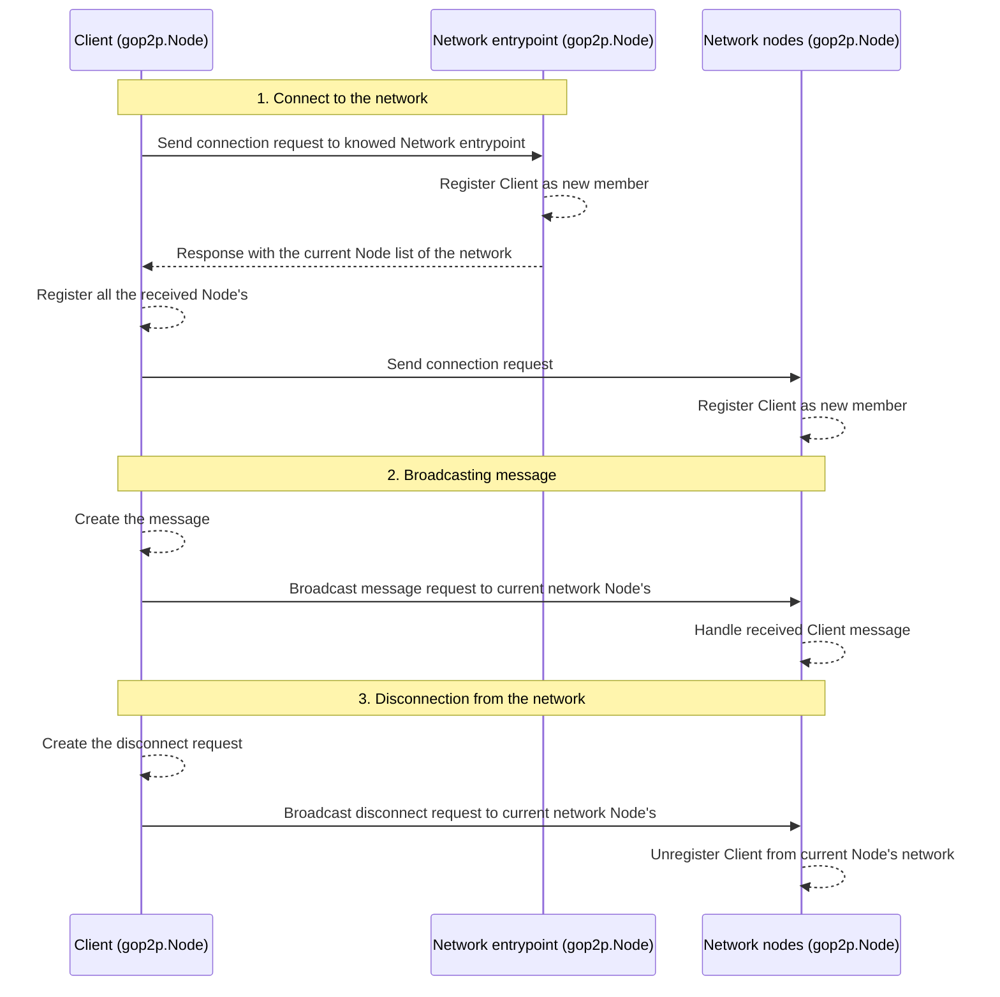

[](https://godoc.org/github.com/lucasmenendez/gop2p) [](https://goreportcard.com/report/github.com/lucasmenendez/gop2p)

# gop2p
Simple *Peer-to-Peer* protocol implementation in pure Go. Uses HTTP client and server to communicate over internet to knowed network members.

## Download
```bash
go get github.com/lucasmenendez/gop2p@latest
```

## Docs & example
Checkout [GoDoc Documentation](https://godoc.org/github.com/lucasmenendez/gop2p).

Also, it is available a simple **example** that implments a CLI Chat [here](example/cli-chat/).

### Workflow explained

gop2p implements the following functional workflow:
 1. **Connect to the network**: The client `gop2p.Node` know a entry point of the desired network (other `gop2p.Node` that is already connected). The entry point response with the current network `gop2p.Node`'s and updates its members `gop2p.Node` list. The client `gop2p.Node` broadcast a connection request to every `gop2p.Node` received from entry point.
 2. **Broadcasting**: The client `gop2p.Node` prepares and broadcast a `gop2p.Message` to every network `gop2p.Node`.
 3. **Disconnect**: The client `gop2p.Node` broadcast a disconnection request to every network `gop2p.Node`. This `gop2p.Node`'s updates its current network members list unregistering the client `gop2p.Node`.


